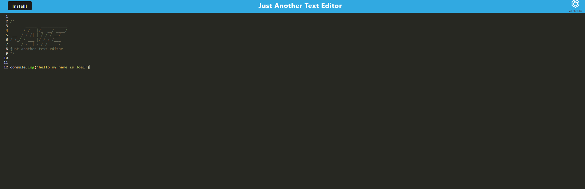

# WEEK19-PWA-TEXT-EDITOR 
I have created a text editor that is downladable

## User Story
AS A developer
I WANT to create notes or code snippets with or without an internet connection
SO THAT I can reliably retrieve them for later use

## Technology used
-HTML

-CSS

-javaScript

## Links

Github Repo: https://github.com/Joelhiguera/week19-PWA-text-editor
Heroku: 

## Screenshot

